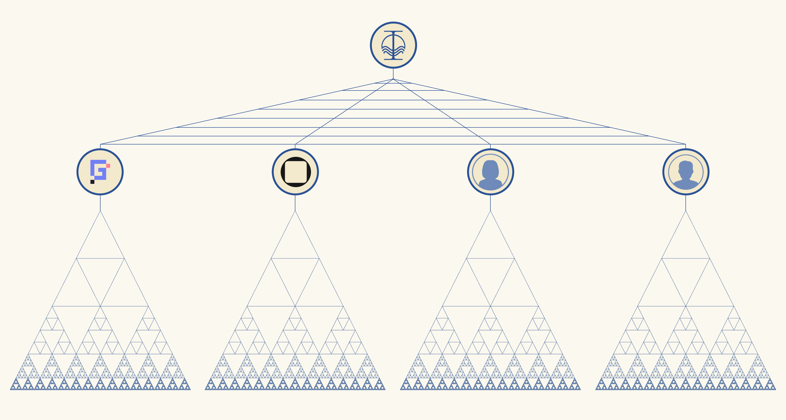

# contracts

Solidity smart contracts for the Orion Finance protocol, defining its tokenomics and its ecosystem, including a suite of tokenized, machine-learning-driven financial strategies in DeFi.

